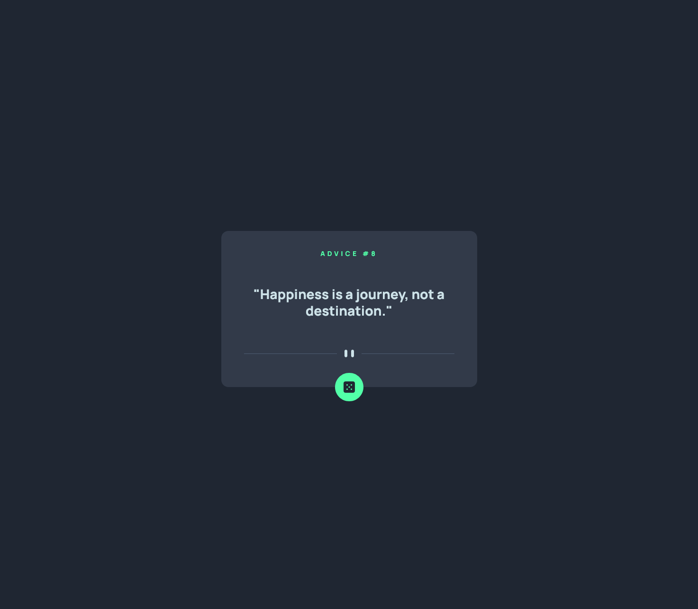
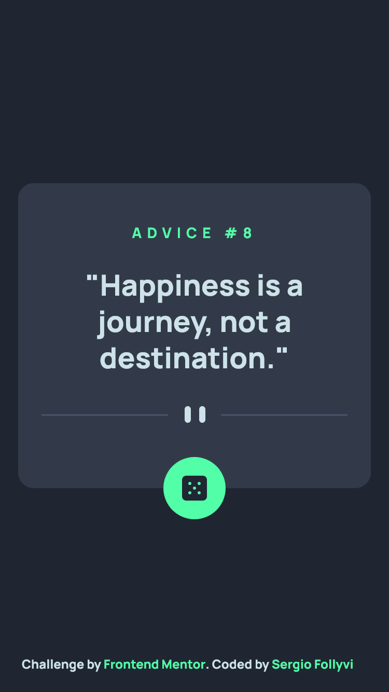

# Frontend Mentor - Advice generator app solution

This is a solution to the [Advice generator app challenge on Frontend Mentor](https://www.frontendmentor.io/challenges/advice-generator-app-QdUG-13db). Frontend Mentor challenges help you improve your coding skills by building realistic projects.

## Table of contents

- [Overview](#overview)
  - [The challenge](#the-challenge)
  - [Screenshot](#screenshot)
  - [Links](#links)
- [My process](#my-process)
  - [Built with](#built-with)
  - [What I learned](#what-i-learned)
  - [Continued development](#continued-development)
  - [Useful resources](#useful-resources)
- [Author](#author)
- [Acknowledgments](#acknowledgments)

## Overview

### The challenge

Users should be able to:

- View the optimal layout for the app depending on their device's screen size
- See hover states for all interactive elements on the page
- Generate a new piece of advice by clicking the dice icon

### Screenshot

#### Desktop



#### Mobile



### Links

- Solution URL: [](https://github.com/serfoll/advice-generator-app)
- Live Site URL: [](https://thriving-faloodeh-e03ea6.netlify.app/)

## My process

### Built with

- Semantic HTML5 markup
- CSS custom properties
- Flexbox
- Mobile-first workflow
- [React](https://reactjs.org/) - JS library
- [Styled Components](https://styled-components.com/) - For styles

### Some of the things that I learned include

- Preventing useEffect from infinte loop by using []

```js
useEffect(() => {
  //funcion here
}, []);
```

- How to get the width of a DOM element

```js
const footerRect = document.getElementById('id').getBoundingClientRect();
console.log(footerRect.width);
```

- No cahce storing when fetching from an API (extra useful when working with firefox)

```js
fetch('api_url', {
  cache: 'no-store',
});
```

### Continued development

Dive more into react hooks and working with APIs and localStorage usage among other things

### Useful resources

- [getBoundingClientRect](https://developer.mozilla.org/en-US/docs/Web/API/Element/getBoundingClientRect) - When in doubt MDN is your friend

## Author

- Frontend Mentor - [@serfoll](https://www.frontendmentor.io/profile/serfoll)
- Twitter - [@sergio_fol](https://www.twitter.com/sergio_fol)
